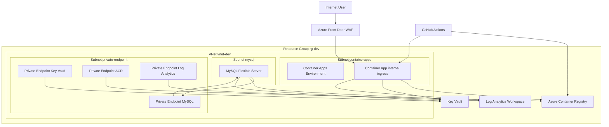

# Azure IaC ロードマップ

### 🧭 全体方針

- リポジトリ名：`containerapps-bicep-lab`（そのまま継続）
- ゴール：
  - Front Door（WAF）を入口とし
  - Container Apps は internal ingress
  - VNet＋3サブネット（CA / MySQL / Private Endpoint）
  - ACR / Key Vault / Log Analytics / MySQL を Private Endpoint＋VNet統合で接続
  - 配線図どおりのネットワーク＋セキュリティ構成を IaC で再現

### **配線図**

### 🟦 1. リポジトリ構成の確立

- **リポジトリ作成：**
  - [ ] `containerapps-bicep-lab` ディレクトリ作成
  - [ ] `subscription/rg.bicep`（RG作成用）
  - [ ] `main.bicep`（全体オーケストレーション）
  - [ ] `modules/` ディレクトリ作成
- **モジュール構成：**
  - [ ] `modules/vnet.bicep`（VNet＋サブネット3つ）
  - [ ] `modules/containerapps-env.bicep`（Environment＋internal ingress前提）
  - [ ] `modules/containerapp.bicep`（アプリ本体）
  - [ ] `modules/acr.bicep`
  - [ ] `modules/mysql-flex.bicep`
  - [ ] `modules/loganalytics.bicep`
  - [ ] `modules/private-endpoints.bicep`（MySQL / KV / ACR / LA）
  - [ ] `modules/keyvault.bicep`
  - [ ] `modules/frontdoor-waf.bicep`
- **パラメータ：**
  - [ ] `parameters/dev.json`（dev環境用）

### 🟦 2. ネットワーク基盤（VNet＋サブネット3つ）

- **VNet：**
  - [ ] `vnet-dev` のアドレス空間を決定（例：10.0.0.0/16）
- **サブネット：**
  - [ ] `containerapps` サブネット（delegation: `Microsoft.Web/containerApps`）
  - [ ] `mysql` サブネット（MySQL Flexible Server 専用）
  - [ ] `private-endpoint` サブネット（Private Endpoint 専用）
- **NSG：**
  - [ ] `containerapps` サブネット用 NSG（Front Door からの inbound のみ許可）
  - [ ] `private-endpoint` サブネット用 NSG（必要に応じて制限）
  - [ ] `mysql` サブネット用 NSG（Container Apps からの接続のみ許可）

### 🟦 3. セキュリティ入口層：Front Door＋WAF

- [ ] `frontdoor-waf.bicep` で Front Door を定義
- [ ] WAF ポリシーを作成（OWASP Top 10 / Geo / Rate Limit）
- [ ] Front Door のバックエンドとして Container Apps のエンドポイントを登録
- [ ] TLS 証明書（Front Door側）を設定
- [ ] ルーティングルール（HTTP→HTTPSリダイレクトなど）を設定

※ この時点では Container Apps はまだ仮のバックエンドでもよい（後で差し替え）。

### 🟦 4. Container Apps 基盤（internal ingress 前提）

- **Environment：**
  - [ ] `containerapps-env.bicep` で Container Apps Environment を作成
  - [ ] `containerapps` サブネットに紐付け（VNet統合）
- **Container App：**
  - [ ] `containerapp.bicep` でアプリ本体を作成
  - [ ] ingress を **internal** に設定（外部公開しない）
  - [ ] CPU / メモリ / スケール設定（KEDAルールは後で）
  - [ ] 環境変数（DB接続文字列など）
  - [ ] Secrets（DBパスワードなど）

### 🟦 5. ACR（コンテナレジストリ）

- [ ] `acr.bicep` で ACR を作成
- [ ] SKU（Basic など）を決定
- [ ] 管理者ユーザー有効化の要否を決定（基本は不要、Managed Identity推奨）
- [ ] 後で Private Endpoint からの接続を前提にする（Public Access制御）

### 🟦 6. MySQL Flexible Server（VNet統合＋Private Endpoint）

- [ ] `mysql-flex.bicep` で MySQL Flexible Server を作成
- [ ] `mysql` サブネットに配置（VNet統合）
- [ ] Private DNS Zone を作成・リンク
- [ ] Firewall を VNet前提に調整（Publicアクセス無効）
- [ ] DBユーザー／パスワードを Key Vault or Bicep パラメータで管理

### 🟦 7. Log Analytics＋診断設定

- [ ] `loganalytics.bicep` で Workspace を作成
- [ ] Container Apps の診断設定（ログ／メトリック）
- [ ] MySQL の診断設定
- [ ] Resource Group 全体の診断設定（必要なら）
- [ ] Retention / SKU を決定

### 🟦 8. Private Endpoint 群（MySQL / KV / ACR / LA）

- [ ] `private-endpoints.bicep` で以下を作成
  - [ ] MySQL 用 Private Endpoint（`private-endpoint` サブネット）
  - [ ] Key Vault 用 Private Endpoint
  - [ ] ACR 用 Private Endpoint
  - [ ] Log Analytics 用 Private Endpoint
- [ ] 各 Private Endpoint と対応する PaaS リソースを関連付け
- [ ] DNS 解決（Private DNS Zone）を構成

### 🟦 9. Key Vault（Secrets 管理）

- [ ] `keyvault.bicep` で Key Vault を作成
- [ ] Container Apps の Managed Identity を Key Vault にアクセス許可
- [ ] DB接続情報・パスワードなどを Key Vault に格納
- [ ] Container Apps から Key Vault 経由で Secrets を取得する設定（Bicep＋構成）

### 🟦 10. IaC デプロイ順序（配線図どおりに組み上げる）

- [ ] `subscription/rg.bicep` で RG 作成
- [ ] `main.bicep` から VNet＋サブネット＋NSG をデプロイ
- [ ] Container Apps Environment＋Container App をデプロイ
- [ ] ACR / MySQL / Log Analytics / Key Vault をデプロイ
- [ ] Private Endpoint 群をデプロイ
- [ ] Front Door＋WAF をデプロイし、バックエンドに Container Apps を紐付け

この順番で進めると、**今の配線図どおりの構成がそのまま Azure 上に立ち上がる**イメージです。

### 🟦 11. アプリ側（コンテナ化＋デプロイ）

- [ ] Dockerfile 作成
- [ ] `docker build` でイメージ作成
- [ ] `az acr login` で ACR にログイン
- [ ] `docker push` で ACR に push
- [ ] Container App の image を ACR のイメージに更新
- [ ] 動作確認（Front Door 経由でアクセス、ログは Log Analytics で確認）

### 🟦 12. 実務レベルの拡張（後続）

- [ ] GitHub Actions で CI/CD パイプライン構築（ACR push → Container Apps 更新）
- [ ] KEDA のスケールルール追加（HTTP / CPU / Queue など）
- [ ] WAF ルールのチューニング（誤検知の調整）
- [ ] NSG ルールの最小権限化
- [ ] 監視・アラート（Log Analytics＋Azure Monitor）